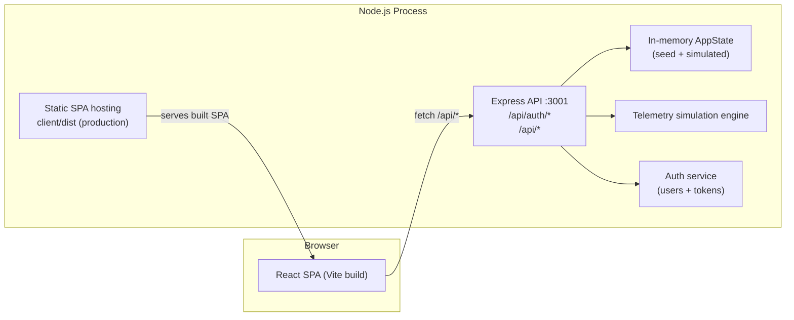
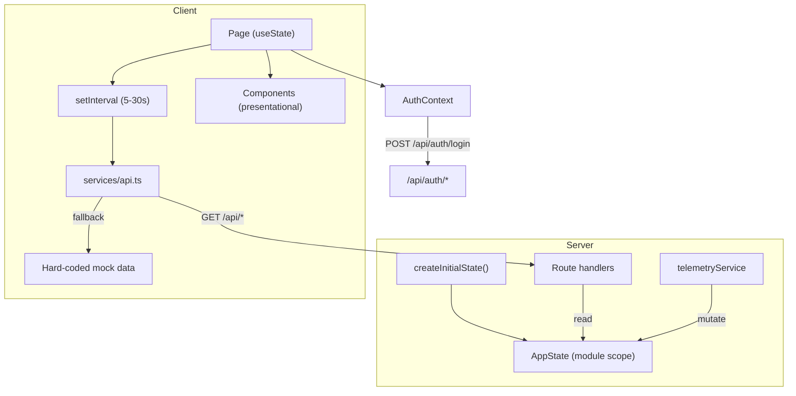
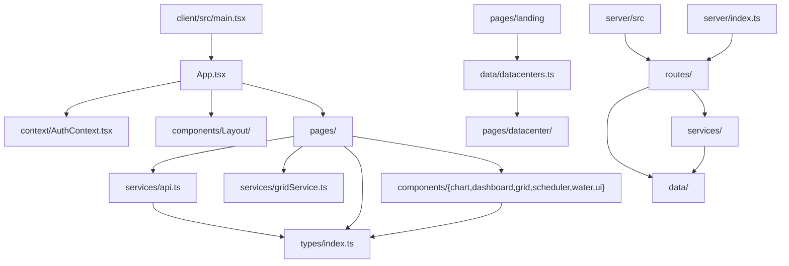

# Architecture

> **PRITHVI — Sustainability OS for Data Centers**
> This document describes the layered architecture, folder responsibilities, and component inventory of the repository, based entirely on the source code.

## Table of Contents

- [1. High-Level Architecture](#1-high-level-architecture)
- [2. Frontend Architecture](#2-frontend-architecture)
- [3. Backend Architecture](#3-backend-architecture)
- [4. Data Flow Overview](#4-data-flow-overview)
- [5. Folder Responsibilities](#5-folder-responsibilities)
- [6. Component Documentation](#6-component-documentation)
- [7. Design Patterns](#7-design-patterns)
- [8. Architecture Diagrams](#8-architecture-diagrams)

---

## 1. High-Level Architecture

PRITHVI is a two-process monorepo: a Vite/React single-page application (`client/`) and an Express/TypeScript API (`server/`). There is no external database, queue, or third-party service.

**Key characteristics**

| Aspect | Implementation |
|---|---|
| Communication | HTTP REST over `/api` (JSON) |
| Frontend dev server | Vite on `:5173`, proxies `/api` → `:3001` |
| Production hosting | Express serves `client/dist` with SPA fallback when it exists |
| Persistence | None — state lives in process memory and resets on restart |
| External dependencies | None (no DB, no cloud, no ML APIs) |

---

## 2. Frontend Architecture

### 2.1 Framework and entry

- React 18 with `react-router-dom` v6 (`BrowserRouter`).
- Entry: `client/src/main.tsx` → renders `<App/>` inside `AuthProvider` + `BrowserRouter`.
- `client/src/App.tsx` defines the route table:
  - **Public**: `/`, `/login`, `/datacenter/:slug`
  - **Protected** (via `ProtectedRoute` + `Layout` sidebar): `/scheduler`, `/dashboard/:slug`, `/water`, `/grid`, `/hardware`, `/ecoscore`, `/reports`
  - **Catch-all** → redirect to `/`
- Route-level code splitting via `React.lazy` for `Landing`, `Login`, `DataCenterPage`, `DataCenterDashboard`. Other pages are statically imported.

### 2.2 State management

- **Auth state**: `AuthContext` (`client/src/context/AuthContext.tsx`) — React Context holding `{ user, token, isAuthenticated }`, hydrated from `localStorage` (`prithvi-auth-session`) on mount.
- **Domain state**: local `useState` per page; pages poll APIs with `setInterval` and render from the response.
- **Grid state**: `GridService` singleton (`client/src/services/gridService.ts`) generates simulated data and holds none across requests; the page stores the latest snapshot in `useState`.

### 2.3 Styling system

- Tailwind CSS with a custom `eco-*` palette (saffron/gold/earth tones) defined in `tailwind.config.js`.
- Reusable component classes in `index.css`: `.glass`, `.glass-strong`, `.glass-glow`, `.btn-primary`, `.btn-secondary`, `.section-title`, `.metric-value`, `.text-gradient`.

### 2.4 Rendering & animation

- **framer-motion** for page/card entry animations, layout animations (scheduler job migration uses `LayoutGroup` + `layout`), and infinite pulse/glow effects.
- **react-countup** for animated savings counters; **react-intersection-observer** for scroll-triggered counters.
- **three / @react-three/fiber / @react-three/drei** only on the landing hero (particle sphere, torus knot, data rings).
- **recharts** for line/area charts; custom SVG for gauges, sparklines, Gantt, heatmaps.

### 2.5 API access layer

`client/src/services/api.ts` is the single REST client. Every endpoint is wrapped by `getJsonWithFallback`, which:

1. `fetch`es the endpoint.
2. Returns parsed JSON on success.
3. Returns a **hard-coded fallback payload** on network failure or non-2xx status.

This makes every page render with demo data even when the server is unreachable (an intentional resilience choice that doubles as an offline demo mode).

### 2.6 Authentication on the client

- `AuthContext.login()` posts to `/api/auth/login`. On `404/500/network` failures it **falls back to a local session** (`fallback-*` token, derived user) so the app remains usable — **Inference**: this appears to be a resilience decision made for demo deployments.
- `ProtectedRoute` redirects unauthenticated users to `/login` with `state.from` for post-login return.

---

## 3. Backend Architecture

### 3.1 Server bootstrap (`server/index.ts`)

1. Creates an initial `AppState` via `createInitialState()` and registers it in the telemetry router module.
2. Mounts middleware: `cors()` (open CORS) + `express.json()`.
3. Mounts routers: `/api/auth` and `/api` (telemetry + domain endpoints).
4. If `client/dist` exists → serves static files and an SPA catch-all (`/*` → `index.html`).
5. Listens on `process.env.PORT || 3001`.

### 3.2 In-memory state model

Single mutable module-scoped `state: AppState` in `server/src/routes/telemetry.ts` (set via `setState()`, exposed via `getState()`). Mutations are performed by the services and the reference is reassigned (`state = applyRecommendation(state, id)`).

### 3.3 Simulation engine (`server/src/services/telemetryService.ts`)

`updateTelemetry(state)` produces a fresh `TelemetryState` on **every call** using:

- A daily sinusoidal baseline (`dayProgress = hour/24`).
- A solar-curve renewable factor: `35 + sin((hour-6)/12·π)·25`.
- Clamped random noise on power, water, COP, carbon, PUE, temperature.
- Rule-based grid stress: `high` if power > 1100 or renewable < 25%; `medium` above 950 / 40%.
- Anomaly roll (~9% combined probability): `heat_spike` (0.8), `renewable_drop` (0.6), `cooling_drift` (0.4).

> **Note**: `updateTelemetry` is exported but never called by any route — telemetry is currently returned as the static seed snapshot. **Inference**: the function was written for a live-refresh pipeline that isn't wired up yet (see Roadmap in docs/roadmap.md).

### 3.4 Recommendation effects

`applyRecommendation(state, id)` marks a recommendation applied (`appliedAt: Date.now()`) and applies hard-coded multiplier effects per recommendation ID (e.g., `rec-1` → power × 0.88, COP +0.15, PUE −0.03; `rec-6` → power × 0.78, carbon × 0.80). It also raises the EcoScore overall +2–6 and each category +1–4 (clamped at 100).

### 3.5 Auth service (`server/src/services/authService.ts`)

- `findUserByCredentials` / `authenticateUser` — plaintext comparison against in-memory `users` array; strips `password` from responses.
- `findOrCreateGoogleUser` — looks up or creates a user (empty password) for the Google-style flow.
- `generateToken(userId)` — base64 of `userId:Date.now():random`.
- `validateToken` — base64-decodes and checks user existence (used nowhere in routes; token validation is not enforced on API endpoints).

### 3.6 Route transform contracts

Routes transform internal state into **client-facing DTOs**:

| Endpoint | Internal | Client DTO |
|---|---|---|
| `/schedule` | `ScheduleJob {startTime,endTime,...}` | `Job {start,end,...}` |
| `/water` | `WaterData` | enriched object (recyclingRate, pueImpact, quality, decisions, forecast, impact, before/after AI) |
| `/hardware` | `HardwareComponent` | adds `rack` (by index), `lifespan` as remaining % |
| `/ecoscore` | categories array | flat breakdown object |

---

## 4. Data Flow Overview

Polling intervals per page:

| Page | Interval |
|---|---|
| Dashboard / Water / Hardware / EcoScore / Advisor | 5 s |
| Scheduler | 30 s |
| Grid | 30 s (client-side simulation; paused after optimization) |

---

## 5. Folder Responsibilities

### `client/src/components/`

| Folder | Responsibility | Key files |
|---|---|---|
| `Layout/` | App shell, sidebar/topbar navigation, route guards | `layout.tsx`, `Navbar.tsx`, `ProtectedRoute.tsx` |
| `chart/` | Reusable chart primitives | `LineChart.tsx` (Recharts), `GaugeChart.tsx`, `HealthBar.tsx` |
| `dashboard/` | Operations-center widgets (KPI, infrastructure, renewable, activity) | `KPICard.tsx`, `InfrastructurePanel.tsx`, `RenewableEnergy.tsx`, `Header.tsx` |
| `grid/` | Grid orchestration widgets | `AIGridCommandCenter.tsx`, `GridMetrics.tsx`, `BlackoutPrediction.tsx`, `RunOptimization.tsx` |
| `scheduler/` | Workload scheduling widgets | `GanttChart.tsx`, `CarbonHeatmap.tsx`, `AIStatusCard.tsx`, `SavingsCounter.tsx` |
| `water/` | Water intelligence widgets | `WaterFlowVisualization.tsx`, `LeakDetectionCard.tsx`, `WaterTankGauge.tsx`, `RainForecastCard.tsx` |
| `ui/` | Generic UI primitives | `MetricCard.tsx`, `RecommendationCard.tsx` |
| (root) | Cross-cutting | `ErrorBoundary.tsx`, `DataCenterCard.tsx`, `DataCenterSection.tsx` |

### `client/src/pages/`

| Folder | Responsibility |
|---|---|
| `landing/` | Public marketing hero (3D scene, stats, PRITHVI acronym defs) |
| `login/` | Auth form (email/password, Google-style, demo autofill) |
| `datacenter/` | `/datacenter/:slug` page + `/dashboard/:slug` protected dashboard |
| `scheduler/` | Command Center — optimization workflow |
| `water/` | Water Intelligence dashboard |
| `grid/` | Grid Monitor — simulation + optimization workflow |
| `hardware/` | Hardware lifecycle grid |
| `ecoscore/` | Weighted sustainability score + 30-day trend |
| `reports/` | Report generation |
| `dashboard/` | Unrouted operations dashboard (not mounted in `App.tsx`) |
| `advisor/` | Unrouted AI Advisor (not mounted in `App.tsx`) |

### `client/src/services/`

| File | Responsibility |
|---|---|
| `api.ts` | All REST calls + fallback payloads |
| `gridService.ts` | Client-side grid simulation singleton (`generateGridData`, `simulateOptimization`) |

### `client/src/context/` / `types/` / `data/`

| Path | Responsibility |
|---|---|
| `context/AuthContext.tsx` | Auth provider, session persistence, fallback auth |
| `types/index.ts` | Shared domain interfaces (Telemetry, Job, GridData, WaterData, ...) |
| `data/datacenters.ts` | Six data center category definitions |

### `server/src/`

| Folder | Responsibility |
|---|---|
| `data/` | In-memory data: `users.ts` (accounts), `telemetry.ts` (interfaces + seed + `createInitialState`) |
| `routes/` | Express routers: `auth.ts`, `telemetry.ts` (all domain endpoints + state holder) |
| `services/` | Business logic: `authService.ts`, `telemetryService.ts` |

---

## 6. Component Documentation

### 6.1 Layout components

#### `Layout` (`components/Layout/layout.tsx`)
- **Responsibility**: Shell wrapping protected pages; renders `Navbar` (sidebar mode) + `<main>`.
- **Props**: `children: ReactNode`.

#### `Navbar` (`components/Layout/Navbar.tsx`)
- **Responsibility**: Branding, nav links, user chip, sign-out.
- **Props**: `isSidebar?: boolean` (sidebar vs topbar styling).
- **Data source**: `useAuth()` for `user` and `logout`.
- **Nav items**: `/scheduler`, `/water`, `/grid`, `/hardware`, `/ecoscore`, `/reports` (lucide icons).

#### `ProtectedRoute` (`components/Layout/ProtectedRoute.tsx`)
- **Responsibility**: Route guard.
- **Behavior**: if `!isAuthenticated` → `<Navigate to="/login" state={{from: location}}/>`.

### 6.2 Chart primitives

#### `LineChart` (`components/chart/LineChart.tsx`)
- Recharts line/area chart with gradient fills and SVG glow filter.
- **Props**: `data`, `lines[{key,color,name}]`, `xKey`, `height?`, `showArea?`.

#### `GaugeChart` (`components/chart/GaugeChart.tsx`)
- 180° segmented SVG gauge (40 segments, animated fill), scale labels 0–100, value anchored at the baseline.
- **Props**: `value`, `max?=100`, `label`, `color?`, `size?=200`.

#### `HealthBar` (`components/chart/HealthBar.tsx`)
- Animated horizontal health bar. **Props**: `value`, `label`, `color?`, `max?=100`.

### 6.3 Dashboard widgets (used by the unrouted `Dashboard` page)

| Component | Responsibility | Props |
|---|---|---|
| `Header` | Live clock/date, system health, uptime, latency chips | — |
| `KPICard` | Metric card: animated number, sparkline, status badge, AI prediction | `label, value, unit, trend, trendValue, icon, color, sparklineData, status, statusLabel, aiPrediction, aiConfidence, lastUpdated` |
| `AIInsights` | Current recommendation with priority, savings metrics, confidence, est. impact | `recommendation, reason, expectedSavings, carbonReduction, confidence, estimatedImpact, priority` |
| `AIForecastTimeline` | 6-hour forecast cards (power/cooling/carbon/temp/renewable) | — (hard-coded) |
| `InfrastructurePanel` | 8 subsystem health bars | — (hard-coded) |
| `RenewableEnergy` | Solar/wind/battery/grid mix bars | — (hard-coded) |
| `SustainabilityPanel` | 6 sustainability metrics + source legend | — (hard-coded) |
| `ActivityFeed` | Timestamped activity timeline | — (hard-coded) |
| `Sparkline`, `StatusBadge`, `AnimatedNumber`, `BackgroundDecor`, `SVGIllustrations` | Presentational primitives | see source |

### 6.4 Scheduler components

| Component | Responsibility | Props |
|---|---|---|
| `AIStatusCard` | Status/confidence/peak-load/carbon-saved + suggested action | `status`, `isOptimizing` |
| `GanttChart` | 24h job timeline; renders current or optimized jobs with migration animation | `jobs`, `isOptimized`, `migratingJobs` |
| `CarbonHeatmap` | Rack-level carbon intensity dots (simulated) | `isOptimized` |
| `SavingsCounter` | CountUp-animated metric | `icon, label, value, suffix, color, inView` |

### 6.5 Water components

| Component | Responsibility | Props |
|---|---|---|
| `AIWaterStatus` | Water saved/efficiency/recycling/confidence hero card | `data: WaterData` |
| `WaterFlowVisualization` | Source → towers → AI → recycling/waste particle animation | — |
| `AIDecisionPanel` | Decision log with reasons + confidence | `decisions[]` |
| `WaterTankGauge` | Tank level visualization (5000 L) | `level` |
| `LeakDetectionCard` | Risk simulation (2–45%), 127 sensors, factors, last scan | `risk?`, `onRiskUpdate?` |
| `RainForecastCard` | Rain forecast + harvest estimate | `forecast` |
| `WaterQualityCard` | pH/purity/cooling-safe checks | `quality` |
| `AIRecommendationCard` | Prioritized saving recommendations | `recommendations[]` |
| `WaterEfficiencyScore` | Gauge wrapper | `score` |
| `EnvironmentalImpactCard` | Water/carbon/energy saved | `impact` |
| `EnhancedWeatherWidget` | Temp/humidity/rain/wind + cooling demand | `weather` |
| `BeforeAfterComparison` | Before vs after AI usage + savings | `before`, `after` |
| `FloatingBubbles` | Ambient background animation | — |
| `WaterScoreGauge` | Circular SVG score gauge | `score, label?, subtitle?, size?` |

> Water types are **redeclared locally** in `water.tsx` and several water components ("to avoid import issues") — a known duplication (see repository audit).

### 6.6 Grid components

| Component | Responsibility | Props |
|---|---|---|
| `AIGridCommandCenter` | Status/AI-mode/failure/optimization-score hero | `data: GridData` |
| `GridStatusCard` | Status icon, pulse ring, optimization ring, quick actions | `status, optimizationScore, isOptimized?` |
| `GridMetrics` | Demand/supply/frequency/carbon intensity tiles | `metrics, isOptimized?` |
| `AIDecisionCenter` | Decision feed with savings + confidence | `decisions[]` |
| `GridStressHeatmap` | Zone load cards (north/east/south/west) | `zones[]` |
| `BlackoutPrediction` | Risk meter, window, cause, recommended action | `prediction` |
| `LiveElectricityPrice` | ₹/kWh price + trend + AI recommendation | `price` |
| `BatteryStatus` | Level bar, backup time, capacity, charging state | `battery` |
| `RunOptimization` | Optimization CTA + in-progress status chips | `onSimulate, isSimulating, isOptimized?, onReset?` |

### 6.7 UI primitives

| Component | Responsibility | Props |
|---|---|---|
| `MetricCard` | Label/value/unit/trend card | `label, value, unit?, trend?, trendValue?, icon, color?` |
| `RecommendationCard` | Recommendation with impact chips, confidence bar, apply button, trade-off | `recommendation`, `onApply(id)` |

### 6.8 Landing components

| Component | Responsibility |
|---|---|
| `Particles` (900-point GPU-friendly particle sphere reacting to mouse) | 3D hero background |
| `FloatingOrb` (torus knot, wireframe gold) | 3D centerpiece |
| `DataRings` (6 rotating rings) | 3D decoration |
| `Scene` | Composes lights + fog + 3D objects |
| `AnimatedCounter` | requestAnimationFrame count-up |
| `ScrollReveal` | framer-motion scroll reveal wrapper |
| `DataCenterSection` / `DataCenterCard` | Six data center category cards |

---

## 7. Design Patterns

| Pattern | Usage |
|---|---|
| **Singleton** | `GridService.getInstance()` (client) |
| **Context + Provider** | `AuthProvider` / `useAuth` |
| **Route guards** | `ProtectedRoute` wrapping layout pages |
| **Fallback data (graceful degradation)** | `getJsonWithFallback` for every API call |
| **DTO transforms** | Routes map internal state → client contracts |
| **Module-scoped state + setter** | `setState`/`getState` in telemetry router |
| **Polymorphic icon mapping** | lucide icon maps (`componentIcons`, `priorityColors`, `statusConfig`) |
| **Presentational composition** | Pages own data fetching; components are pure-presentational |
| **Simulation-as-a-service** | Deterministic sinusoidal + noise generators (`updateTelemetry`, `GridService.generateGridData`) |

---

## 8. Architecture Diagrams

### Component hierarchy (routed pages)

```mermaid
graph TD
    APP["<b>&lt;App/&gt;</b> (AuthProvider + Suspense + Routes)"]
    APP --> LANDING["Landing (lazy)"]
    APP --> LOGIN["Login (lazy)"]
    APP --> DCP["DataCenterPage (lazy)"]
    APP --> PR["<b>ProtectedRoute</b> + Layout (Navbar sidebar)"]
    PR --> SCHED["Scheduler"]
    PR --> DCD["DataCenterDashboard (lazy)"]
    PR --> WATER["Water"]
    PR --> GRID["GridMonitor"]
    PR --> HW["Hardware"]
    PR --> ECO["EcoScore"]
    PR --> RPT["Reports"]

    SCHED --> AISTATUS["AIStatusCard"] & GANTT["GanttChart"] & CARBON["CarbonHeatmap"] & SAVE["SavingsCounter"]
    WATER --> AIWS["AIWaterStatus"] & FLOW["WaterFlowVisualization"] & DEC["AIDecisionPanel"] & TANK["WaterTankGauge"] & LEAK["LeakDetectionCard"] & RAIN["RainForecastCard"] & QUAL["WaterQualityCard"] & REC["AIRecommendationCard"] & EFF["WaterEfficiencyScore"] & IMP["EnvironmentalImpactCard"] & WX["EnhancedWeatherWidget"] & BEF["BeforeAfterComparison"]
    GRID --> CMD["AIGridCommandCenter"] & GSTAT["GridStatusCard"] & GMET["GridMetrics"] & DCS["AIDecisionCenter"] & HEAT["GridStressHeatmap"] & BLACK["BlackoutPrediction"] & PRICE["LiveElectricityPrice"] & BATT["BatteryStatus"] & RUN["RunOptimization"]
    HW --> HB["HealthBar"]
    ECO --> GAUGE["GaugeChart"] & HB2["HealthBar"] & LINE["LineChart"]
```

### Folder dependency graph

---

*Next: [System Design](system-design.md) · [Flowcharts](flowcharts.md) · [API Reference](api.md)*
