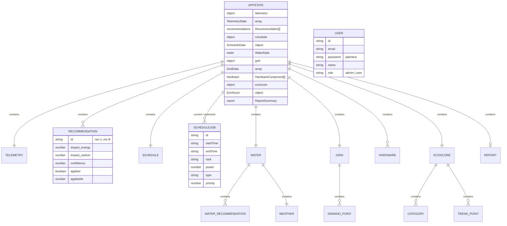
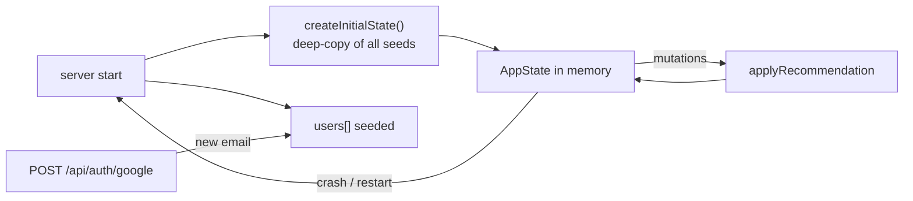

# Database & Data Models

> **PRITHVI — Sustainability OS for Data Centers**
> There is **no database**. All data lives in process memory (server) or `localStorage` (client). This document describes every data model, its provenance, and the path to real persistence.

## Table of Contents

- [1. Data Architecture Overview](#1-data-architecture-overview)
- [2. Entity-Relationship Model](#2-entity-relationship-model)
- [3. Server Data Models](#3-server-data-models)
- [4. Client Data Models](#4-client-data-models)
- [5. Seed Data Inventory](#5-seed-data-inventory)
- [6. Data Provenance Matrix](#6-data-provenance-matrix)
- [7. Persistence & Lifecycle](#7-persistence--lifecycle)
- [8. Production Data Layer Roadmap](#8-production-data-layer-roadmap)

---

## 1. Data Architecture Overview

| Store | Location | Contents | Lifetime |
|---|---|---|---|
| `AppState` (in-memory) | `server/src/routes/telemetry.ts` module scope | Telemetry, recommendations, schedule, water, grid, hardware, ecoscore, report | Process lifetime — **lost on restart** |
| `users[]` (in-memory) | `server/src/data/users.ts` | 2 seeded users; grows when Google-style sign-ups occur | Process lifetime |
| `localStorage["prithvi-auth-session"]` | browser | `{ token, user }` | Until logout / manual clear |
| Fallback payloads | `client/src/services/api.ts` source | Hard-coded mock data per endpoint | Immutable (compile-time) |
| `GridData` | generated per call | `GridService` singleton output | Held in page `useState` |

**Consequences of no persistence:**

- All changes (applied recommendations, score gains, new users) vanish on restart.
- No historical time-series exists server-side; the only "trend" is the **generated** 30-day EcoScore trend (random-walk seed).
- No multi-instance deployment is possible without a shared store.

---

## 2. Entity-Relationship Model



---

## 3. Server Data Models

All interfaces defined in `server/src/data/telemetry.ts`; `User` in `server/src/data/users.ts`.

### 3.1 `AppState` (root aggregate)

| Field | Type | Notes |
|---|---|---|
| `telemetry` | `TelemetryState` | live snapshot (currently static seed) |
| `recommendations` | `Recommendation[]` | 8 seed items |
| `schedule` | `ScheduleData` | `{ current, optimized, savings }` |
| `water` | `WaterData` | usage, breakdown, weather, recommendations |
| `grid` | `GridData` | demand series (24 pts), risk, DR actions |
| `hardware` | `HardwareComponent[]` | 16 components |
| `ecoscore` | `EcoScore` | overall + 5 weighted categories + 30-day trend |
| `report` | `ReportSummary \| null` | seeded, never updated by API |

### 3.2 `TelemetryState`

| Field | Type | Seed | Simulation range |
|---|---|---|---|
| `power` | number (kW) | 950 | 750–1250 |
| `water` | number (L) | 4800 | 3800–6200 |
| `coolingEfficiency` | number (COP) | 4.0 | 3.4–4.6 |
| `carbon` | number (kg) | 280 | 180–420 |
| `renewableShare` | number (%) | 45 | 15–75 |
| `gridStress` | enum | medium | low/medium/high |
| `avgTemperature` | number (°C) | 25 | 21–29 |
| `pue` | number | 1.45 | 1.3–1.7 |
| `timestamp` | number | now | — |
| `anomaly` | object \| null | null | heat_spike / renewable_drop / cooling_drift |

### 3.3 `Recommendation`

`id`, `title`, `description`, `impact: { energy, water?, carbon }` (%), `confidence` (0–100), `priority: critical|high|medium|low`, `tradeoff`, `applied: boolean`, `appliedAt: number|null`. Client type omits `critical` priority and makes `water` required — a type mismatch.

### 3.4 `ScheduleData` / `ScheduleJob`

- `savings: { energy: "8.2%", carbon: "14.5%" }` — **defined in state, never serialized to clients**.
- `ScheduleJob`: `id`, `name`, `startTime`/`endTime` (`"HH:MM"`), `rack` (e.g. `"A1-A4"`), `power` (kW), `type` (`AI Training|Batch ETL|Backup|Inference`), `priority` (1–5).
- Client `Job` mirrors it with `start`/`end` (renamed) and requires `type`.

### 3.5 `WaterData`

| Field | Type | Seed |
|---|---|---|
| `currentUsage` | number | 4800 |
| `breakdown` | `{ coolingTowers, chillers, adiabatic }` | 2800 / 1500 / 500 |
| `weather` | `{ temp, humidity, wetBulb, coolingDemand, rainProbability, windSpeed }` | 22.4 / 58 / 18 / "Low" / 74 / 12 |
| `recommendations` | `WaterRecommendation[]` | 2 items (adiabatic pre-cooling 95 L, drift eliminators 40 L) |

### 3.6 `GridData`

- `demandSeries`: 24 points `{ time: "HH:00", grid, dc }` — generated at seed time with sine + random noise.
- `riskIndicator`: `medium`; `demandResponseActions`: 3 strings.

### 3.7 `HardwareComponent`

`id` (`hw-1..16`), `name`, `type` (`GPU|CPU|SSD|Fan|PSU`), `healthScore`, `lifespan` (years), `usedLifespan`, `failureRisk` (`low|medium|high`), `recommendation` (string). Inventory: 4 GPU, 3 CPU, 3 SSD, 3 Fan, 3 PSU.

### 3.8 `EcoScore`

| Field | Type | Seed |
|---|---|---|
| `overall` | number | 72 |
| `categories` | `EcoScoreCategory[]` | Energy Efficiency 78 (w 0.30), Renewable Usage 65 (0.25), Water Stewardship 70 (0.20), Hardware Lifecycle 68 (0.15), Carbon Footprint 74 (0.10) |
| `trend` | 30 × `{ date, score }` | generated: `65 + random*15 + i*0.2` |

### 3.9 `ReportSummary`

`generatedAt`, `timeRange`, `totals { energyKwh: 22000, waterL: 112000, carbonKg: 6400 }`, `topActions[]`, `ecoScore: 72`. **Unused by the API** — `/api/report` returns a different hard-coded shape.

### 3.10 `User`

| Field | Seed | Notes |
|---|---|---|
| `id` | `"1"`, `"2"` | Google-style users get `google-<timestamp>` |
| `email` | admin@prithvi.ai, demo@prithvi.ai | |
| `password` | `password123`, `demo123` | **plaintext in source** |
| `name` | Admin User / Demo User | |
| `role` | admin / user | **never enforced** anywhere |

---

## 4. Client Data Models

`client/src/types/index.ts` defines the **wire contracts** consumed by pages:

| Interface | Used by | Divergence from server |
|---|---|---|
| `TelemetryData` | (unused page-wise) | identical minus `anomaly` (client omits) |
| `Job` | Scheduler | renamed `start`/`end`; `type` required |
| `ScheduleData` | Scheduler | client version has no `savings` |
| `WaterData` | Water | client expects route's enriched DTO (matches server response) |
| `HardwareComponent` | Hardware | client version has `health` (not `healthScore`), no `name`/`lifespan` years |
| `EcoScoreBreakdown` | EcoScore | flat fields (matches route response) |
| `GridData` | GridMonitor | **full client-side model** — server `/api/grid` DTO does not match it |
| `Recommendation` | Advisor/EcoScore | server `critical` priority not representable |

**LocalStorage schema** (`prithvi-auth-session`):

```json
{
  "token": "<base64 or fallback-*>",
  "user": { "id": "1", "email": "admin@prithvi.ai", "name": "Admin User", "role": "admin" }
}
```

---

## 5. Seed Data Inventory

| Dataset | Rows | Key values |
|---|---|---|
| Users | 2 | admin@prithvi.ai / password123; demo@prithvi.ai / demo123 |
| Recommendations | 8 | rec-1..rec-8 (confidence 65–98; priority critical×1, high×3, medium×3, low×1) |
| Schedule jobs | 7 + 7 | current vs optimized windows differ for jobs 1–7 |
| Water recs | 2 | saving 95 L / 40 L |
| Hardware | 16 | 2 high-risk (SSD hw-6, PSU hw-11), 3 medium-risk |
| Grid series | 24 | deterministic-ish sine + random |
| EcoScore trend | 30 | monotonic upward drift + noise |
| Report | 1 | totals 22000 kWh / 112000 L / 6400 kg |

---

## 6. Data Provenance Matrix

| Data | Source of truth | Staleness |
|---|---|---|
| Telemetry snapshot | seed constant | static for process lifetime |
| Telemetry (intended) | `updateTelemetry()` simulation | would update per call — **not wired** |
| EcoScore | seed; mutated by apply + client-side random jitter on each fetch | jitter makes client display differ from server |
| Water payload | mostly hard-coded in route | static |
| Schedule | seed (both lists) | static |
| Grid (server) | seed | static |
| Grid (client) | `GridService` per-call generation | new snapshot each 30 s until optimized |
| Recommendations | seed | mutable only via apply |
| Users | seed + runtime push | new Google users lost on restart |

---

## 7. Persistence & Lifecycle



No snapshots, no write-ahead log, no serialization. The client is similarly stateless between sessions (auth excepted).

---

## 8. Production Data Layer Roadmap

| Priority | Change | Rationale |
|---|---|---|
| P0 | SQLite/Postgres persistence for `AppState` | stop data loss; enable multi-instance |
| P0 | Time-series table for telemetry | real trends, history, reporting |
| P1 | User table with hashed passwords (bcrypt/argon2) + sessions/JWT | plaintext + base64 tokens are critical |
| P1 | Store applied-recommendation audit trail | `appliedAt` is not enough |
| P2 | Migration of hard-coded water/report/ecoscore values into DB-seeded config | remove route-level magic numbers |
| P2 | Unify client `GridData` and server `/api/grid` on one schema | today they are two separate models |

---

*Next: [Security Review](security.md) · [Performance & Scalability](performance.md)*
