# Flowcharts — Workflow Diagrams

> **PRITHVI — Sustainability OS for Data Centers**
> End-to-end user and system workflows, mapped directly from the page, component, and service implementations.

## Table of Contents

- [1. User Journey Overview](#1-user-journey-overview)
- [2. Login Flow](#2-login-flow)
- [3. Route Protection Flow](#3-route-protection-flow)
- [4. Scheduler — Workload Optimization Workflow](#4-scheduler--workload-optimization-workflow)
- [5. Grid Monitor — Optimization Workflow](#5-grid-monitor--optimization-workflow)
- [6. Water Intelligence — Data and Leak Detection Flow](#6-water-intelligence--data-and-leak-detection-flow)
- [7. EcoScore — Apply Recommendation Flow](#7-ecoscore--apply-recommendation-flow)
- [8. Hardware — Lifecycle Monitoring Flow](#8-hardware--lifecycle-monitoring-flow)
- [9. Reports — Generation Flow](#9-reports--generation-flow)
- [10. Data Center Exploration Flow](#10-data-center-exploration-flow)
- [11. Data Acquisition and Fallback Flow](#11-data-acquisition-and-fallback-flow)
- [12. Error Handling Flow](#12-error-handling-flow)

---

## 1. User Journey Overview

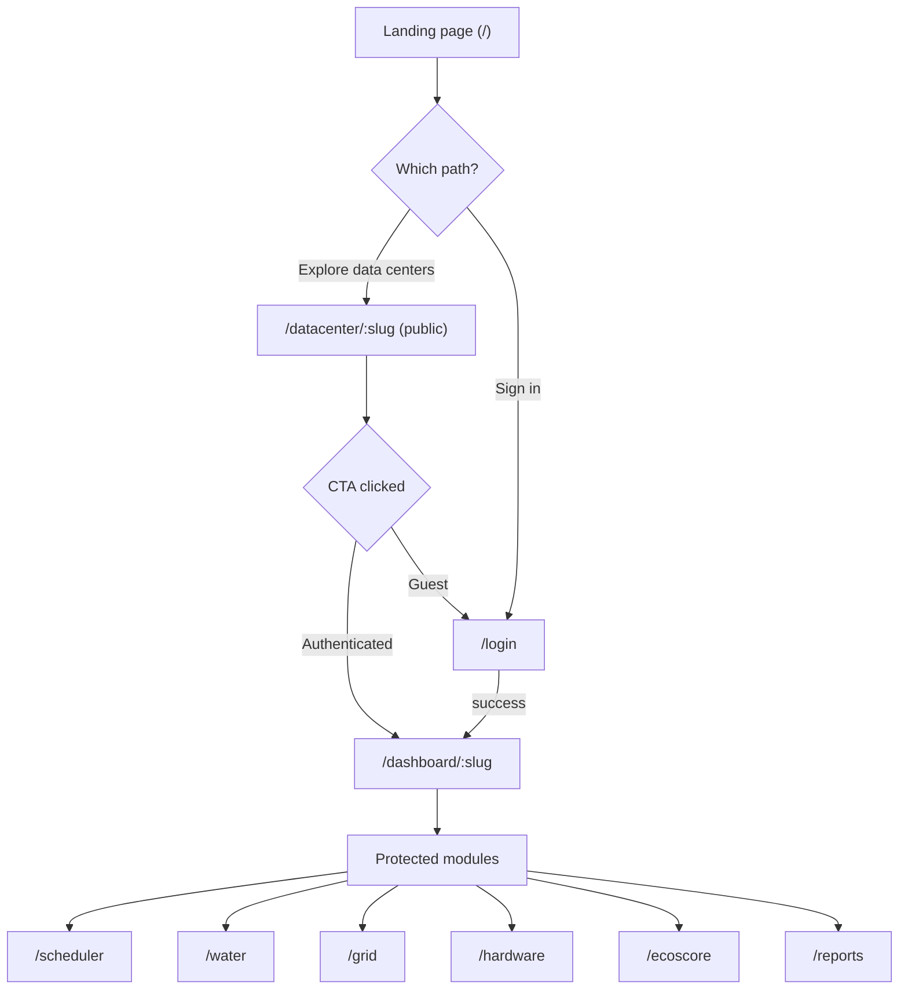

---

## 2. Login Flow

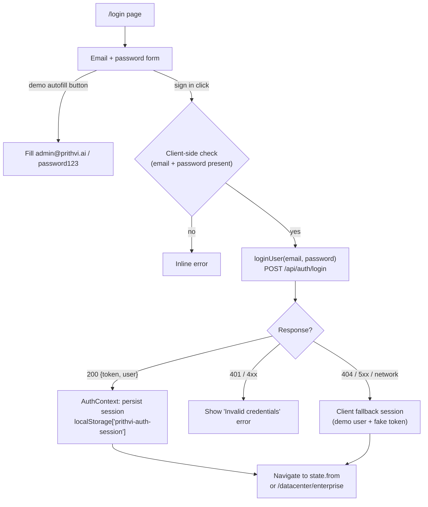

---

## 3. Route Protection Flow

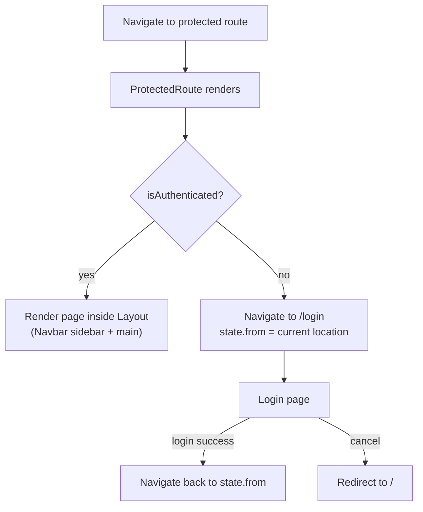

---

## 4. Scheduler — Workload Optimization Workflow

Timeline: mount → poll every 30 s → optimize → animated migration → reset.

```mermaid
sequenceDiagram
    participant P as Scheduler page
    participant API as services/api.ts
    participant S as Server /api/schedule
    participant UI as AIStatusCard / GanttChart / SavingsCounter

    P->>API: fetchSchedule()
    API->>S: GET /api/schedule
    S-->>P: { current, optimized }
    P->>P: analyzeWorkload(current) → peak hours (first/last job)
    loop every 30s
        P->>API: fetchSchedule()
    end

    User->>P: Click "Run Optimization"
    P->>P: isOptimizing = true; AIStatus = "optimizing"
    P->>P: stagger migratingJobs flags (t=1s + 300ms × index)
    Note over P: GanttChart + job cards animate migration
    P->>P: await 3.5s (simulated AI processing)
    P->>P: isOptimized = true; AIStatus = "completed" (23% savings)
    P-->>UI: displayJobs = schedule.optimized

    User->>P: Click "Reset"
    P->>P: isOptimized = false; migratingJobs = {}; AIStatus = "idle"
    P-->>UI: displayJobs = schedule.current
```

**Notes:** the actual optimization decision is **pre-computed in seed data** (`initialSchedule.optimized`); the page never POSTs to the server for this workflow — `optimizeSchedule` exists in `api.ts` but the page does not call it.

---

## 5. Grid Monitor — Optimization Workflow

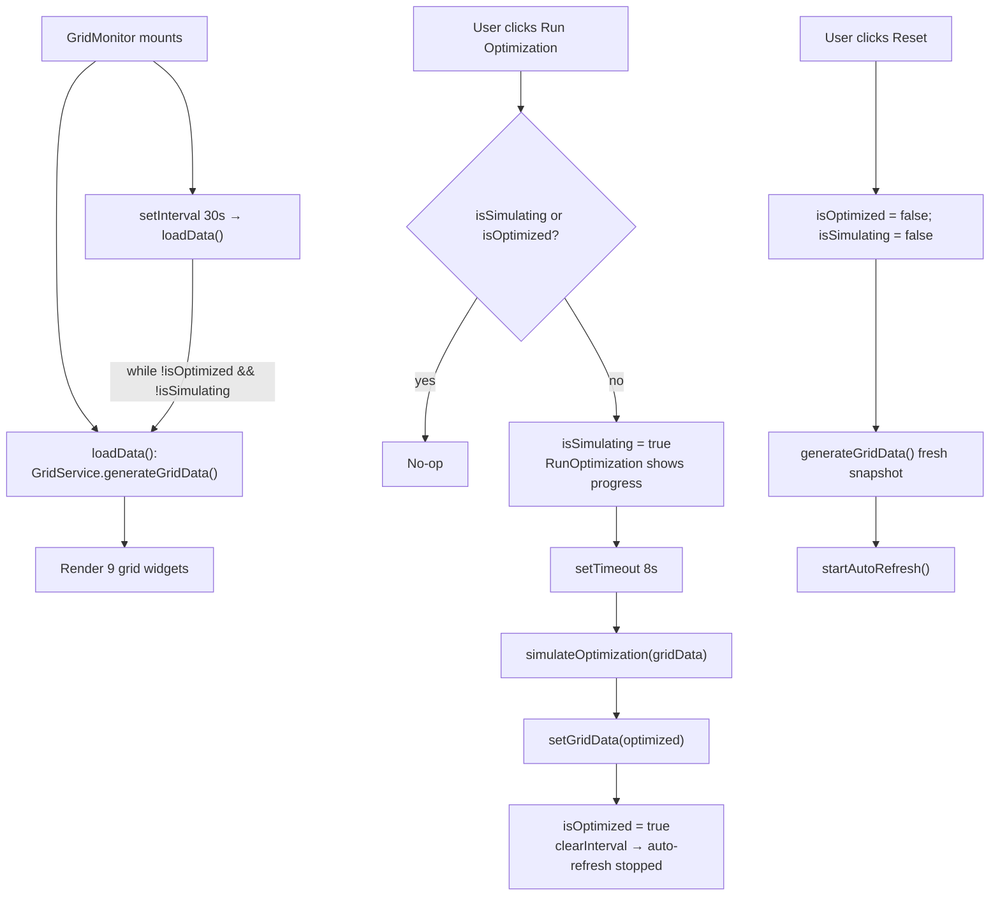

**Decision rule** (in `GridService`): `status = 'critical'` when demand > 2400; otherwise `'optimal'`/`'stable'` by thresholds.

---

## 6. Water Intelligence — Data and Leak Detection Flow

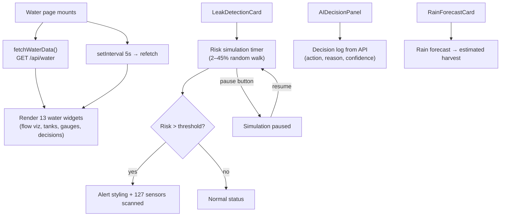

---

## 7. EcoScore — Apply Recommendation Flow

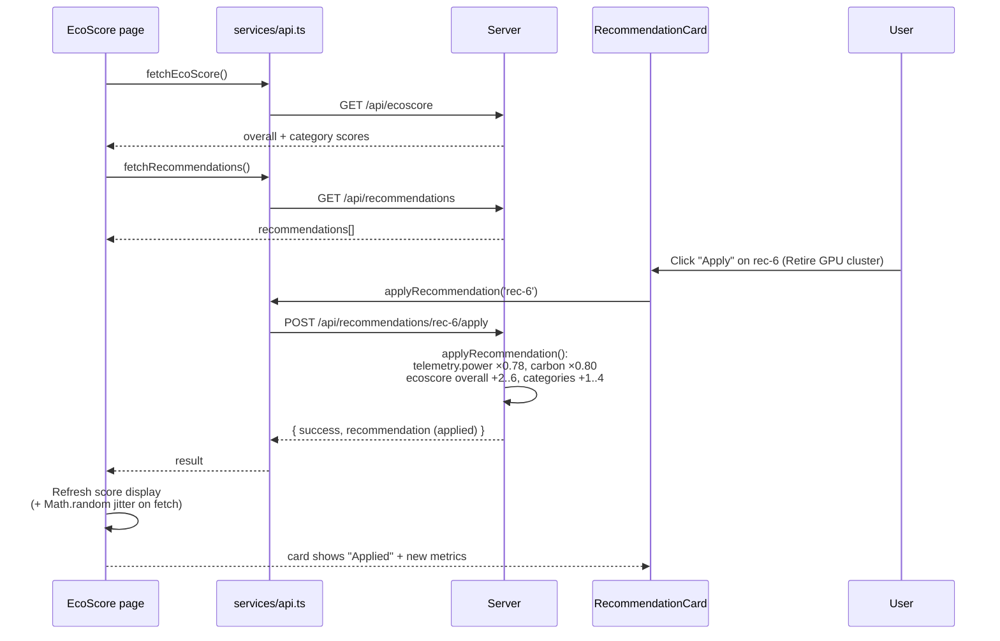

**Error paths:** unknown ID → `404`; already applied → `400`; both surfaced by the card without breaking the page.

---

## 8. Hardware — Lifecycle Monitoring Flow

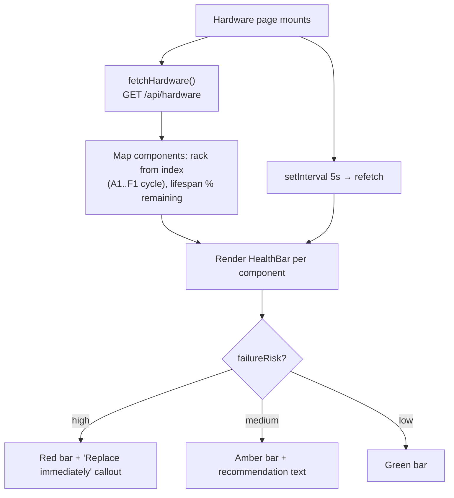

---

## 9. Reports — Generation Flow

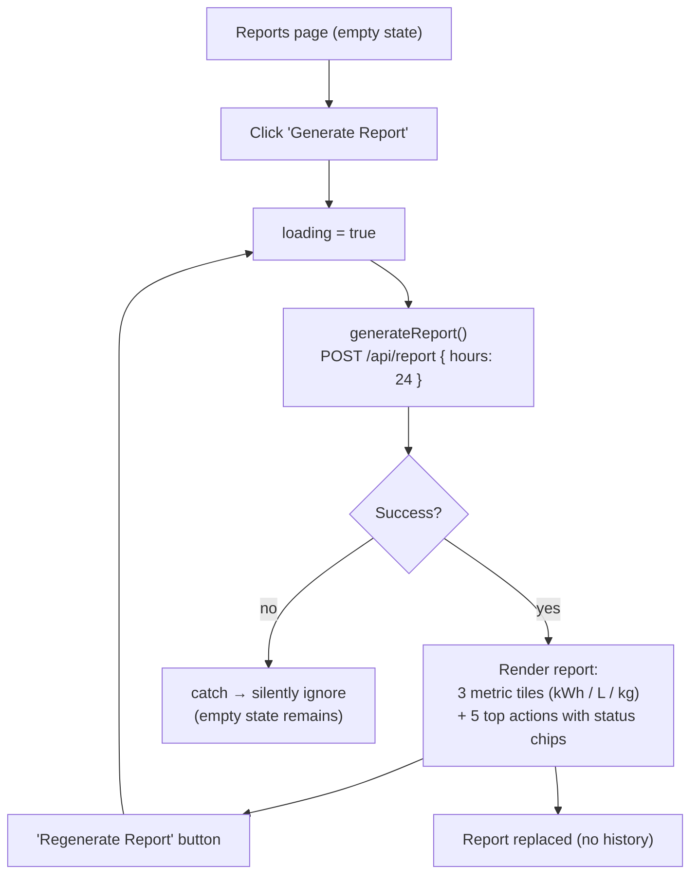

---

## 10. Data Center Exploration Flow

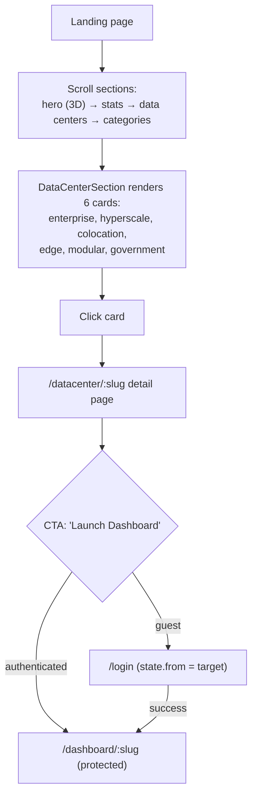

---

## 11. Data Acquisition and Fallback Flow

Every page's data request funnels through `getJsonWithFallback`:

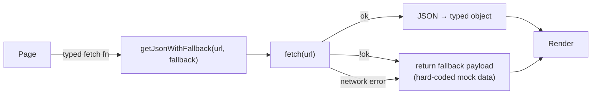

---

## 12. Error Handling Flow

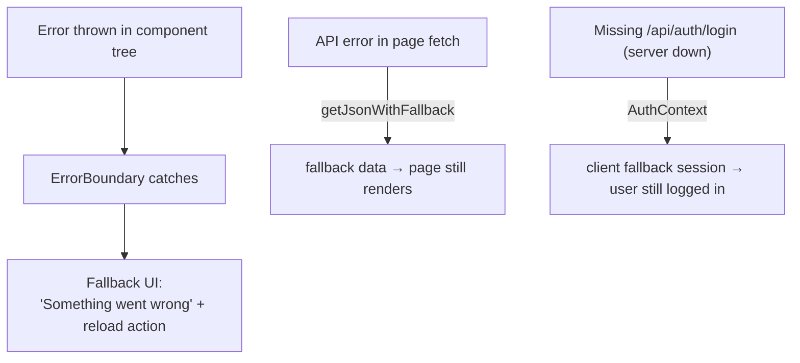

**Caveat (design consequence):** because every layer degrades gracefully, genuine outages are visually silent — the app never indicates that data is simulated/offline (see repository audit).

---

*Next: [API Reference](api.md) · [Database & Data Models](database.md)*
