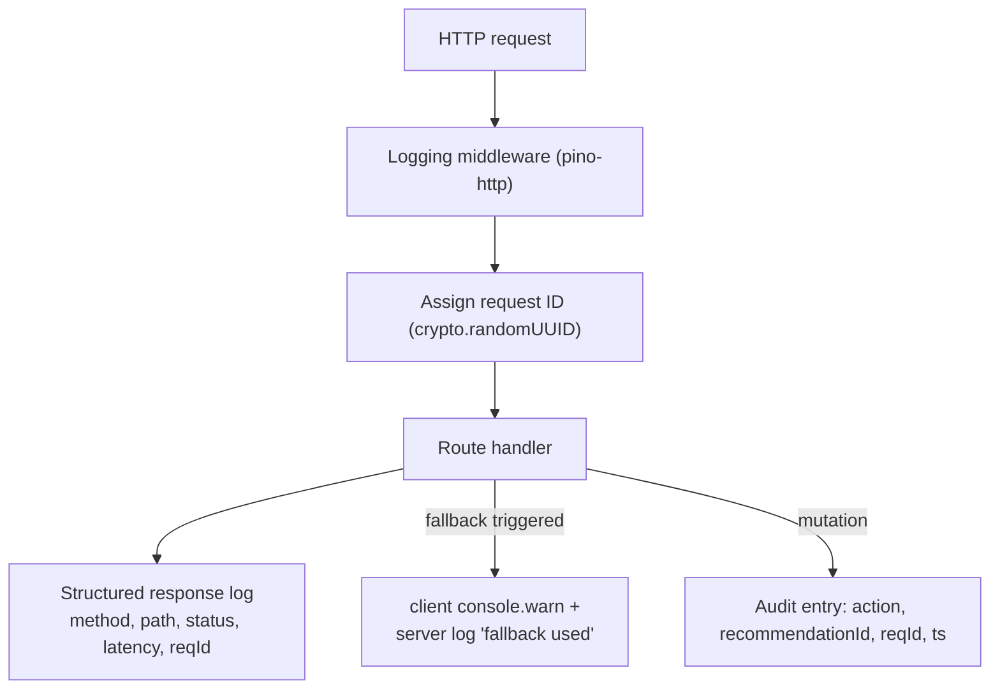

# Observability

> **PRITHVI — Sustainability OS for Data Centers**
> What is observable today, what is not, and how to build production-grade visibility.

## Table of Contents

- [1. Current State](#1-current-state)
- [2. What Exists Today](#2-what-exists-today)
- [3. Observability Gaps](#3-observability-gaps)
- [4. Proposed Telemetry Design](#4-proposed-telemetry-design)
- [5. Client-Side Observability](#5-client-side-observability)
- [6. Alerting and Dashboards](#6-alerting-and-dashboards)
- [7. Acceptance Criteria](#7-acceptance-criteria)

---

## 1. Current State

**Score: 2/10.** The application is instrumented with exactly three signals:

1. `GET /api/health` — a liveness probe (`server/src/routes/telemetry.ts:17`).
2. `console.error` — auth error logging (`authService.ts:107`, `auth.ts:36`).
3. Client `ErrorBoundary` — a fallback screen on render errors (`components/ErrorBoundary.tsx`).

There are no logs, metrics, traces, request IDs, or dashboards. No logging library is installed in either workspace.

---

## 2. What Exists Today

| Signal | Implementation | Usability |
|---|---|---|
| Liveness | `/api/health` → `{ status: 'ok', timestamp }` | Platform probes ready |
| Readiness | None (would need DB/state check) | — |
| Server logs | Implicit Express request logging (dev), `console.error` on auth failures | Terminal only; unstructured |
| Client errors | `ErrorBoundary` UI fallback (no reporting) | Local only |
| Fallback activation | **Silent** — when a page falls back to mock data, nothing is emitted | **Not observable at all** |

---

## 3. Observability Gaps

| # | Gap | Impact | Evidence |
|---|---|---|---|
| G1 | No request logging middleware | Can't see traffic, errors, or latency | no `morgan`/`pino` in any package.json |
| G2 | No request IDs / correlation | Can't trace a failing request | no middleware |
| G3 | No structured error responses (non-auth routes) | Errors invisible outside dev console | routes return only payloads or fallbacks |
| G4 | Fallback data activation is silent | Operators can't tell demo data from live data | `getJsonWithFallback` swallows errors (`api.ts:51-61`) |
| G5 | No metrics (CPU, memory, request counts) | No capacity planning | none |
| G6 | No client-side error reporting | Production UI bugs unreported | ErrorBoundary has no reporter |
| G7 | No audit trail for mutations | Can't see who/when recommendations were applied | only `appliedAt` timestamp |
| G8 | No logging of the simulation engine | `updateTelemetry` failures (if wired) invisible | engine is dead code today |

---

## 4. Proposed Telemetry Design



### 4.1 Server-side proposal

| Layer | Recommendation | Why |
|---|---|---|
| Logging | **pino + pino-http** (or morgan JSON) | Structured JSON logs, low overhead, standard |
| Request ID | middleware assigning `X-Request-Id` | Correlation across client/server |
| Metrics | `prom-client` exposing `/metrics` | Prometheus/Grafana integration |
| Health split | `/api/health` (liveness) + `/api/ready` (state initialized check) | Platform-grade probes |
| Audit trail | append-only log for `POST /api/recommendations/:id/apply` and auth events | security.md §12 A09 |

### 4.2 Structured log example

```json
{
  "level": "info",
  "time": "2026-07-31T12:00:00.000Z",
  "reqId": "9f8a…",
  "method": "GET",
  "path": "/api/water",
  "status": 200,
  "durationMs": 2,
  "fallbackUsed": false
}
```

---

## 5. Client-Side Observability

| Signal | Proposal |
|---|---|
| Fallback activation | `console.warn('[PRITHVI] using fallback for <endpoint>')` + optional `navigator.sendBeacon` report endpoint |
| Rendering errors | report `componentStack` from `ErrorBoundary` to a collector |
| Web vitals | `web-vitals` package → LCP/CLS/INP metrics |
| Route changes | emit to analytics (page views) |

**Minimum viable**: mark every fallback render in the UI (e.g., an "offline/demo data" banner) — this closes G4, the highest-visibility gap, without any infra.

---

## 6. Alerting and Dashboards

- **Grafana dashboard** panels: request rate by route, p95 latency, 5xx rate, fallback rate (from log field), memory/CPU (process metrics).
- **Alerts**:
  - `fallbackUsed = true` rate > 0 over 5 min → "Client falling back — API degraded"
  - `/api/health` 5xx → "API down"
  - P95 latency > 500 ms over 10 min → "API slow"
- **Where**: self-hosted Prometheus + Grafana, or managed (Datadog/New Relic) once Phase 1 auth/DB lands.

---

## 7. Acceptance Criteria

- [ ] Every HTTP request is logged with `reqId`, latency, and status (JSON)
- [ ] Fallback activation is visible: log line on server (if caused server-side) and warn/banner on client
- [ ] `/api/health` + `/api/ready` exist and are documented in api.md
- [ ] Mutation and auth events are auditable (who/what/when)
- [ ] `/metrics` endpoint exposed for Prometheus
- [ ] Grafana dashboard panels for requests, latency, 5xx, fallback rate

---

*Next: [Repository Audit](repository-audit.md) — the full codebase quality assessment.*
