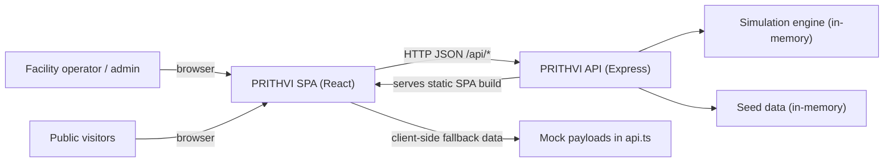
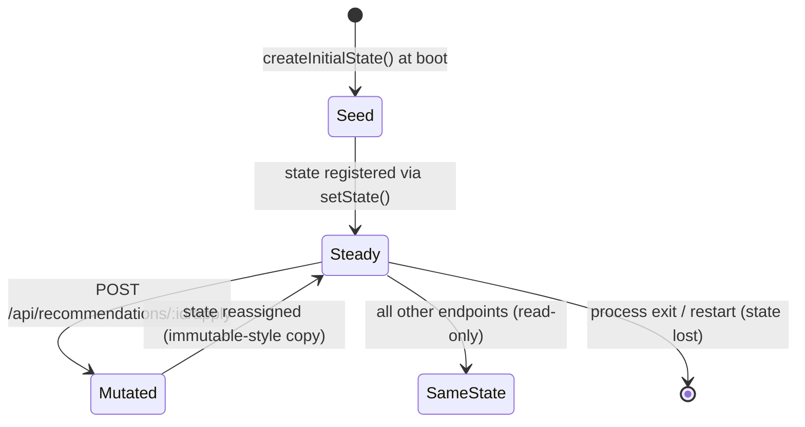
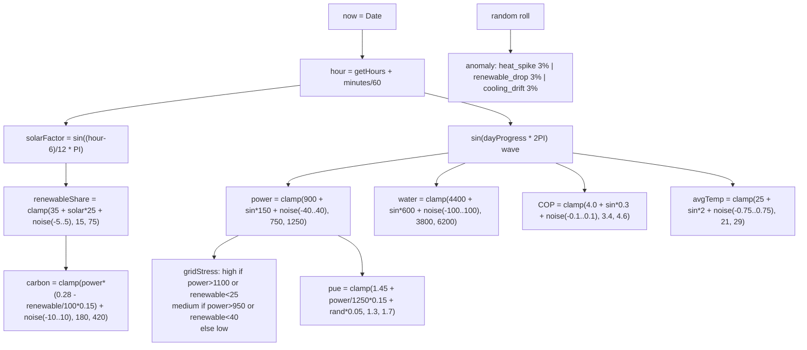
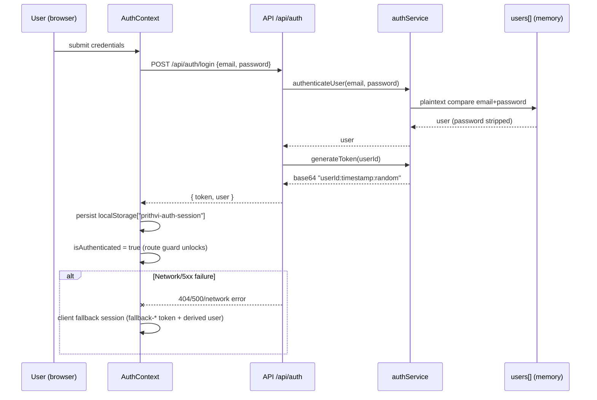
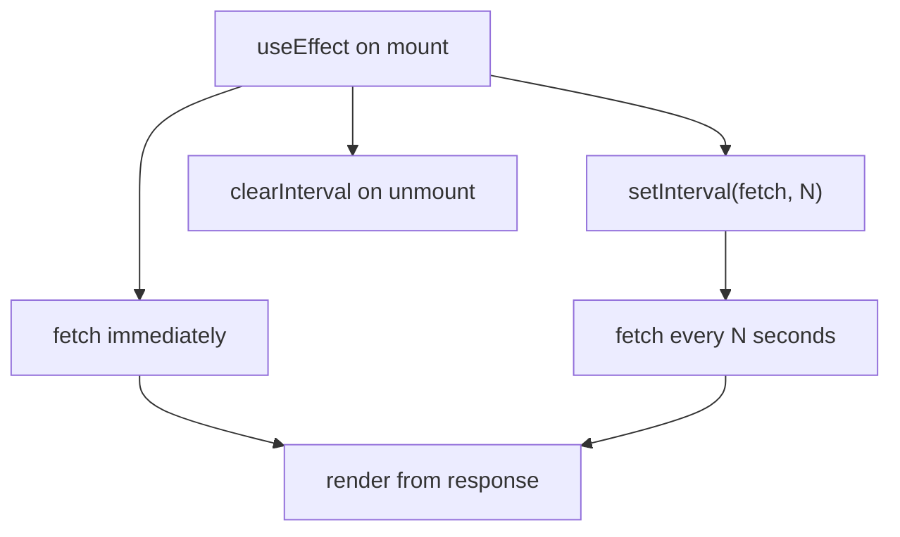
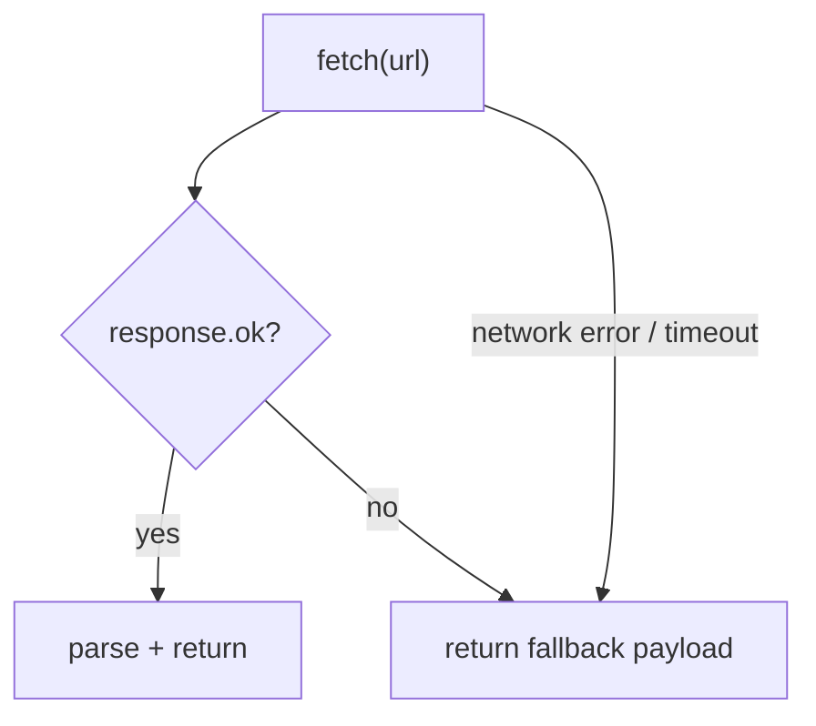

# System Design

> **PRITHVI — Sustainability OS for Data Centers**
> A detailed design description of the system: modules, state, data flows, simulation engine, and failure behavior, based strictly on the source code.

## Table of Contents

- [1. Design Goals and Constraints](#1-design-goals-and-constraints)
- [2. System Context](#2-system-context)
- [3. Module Design](#3-module-design)
- [4. State Management Design](#4-state-management-design)
- [5. Telemetry Simulation Engine](#5-telemetry-simulation-engine)
- [6. Recommendation Effects Model](#6-recommendation-effects-model)
- [7. Authentication Design](#7-authentication-design)
- [8. Client-Side Data Acquisition](#8-client-side-data-acquisition)
- [9. Grid Simulation Design](#9-grid-simulation-design)
- [10. Failure Modes and Resilience](#10-failure-modes-and-resilience)
- [11. Concurrency and Consistency](#11-concurrency-and-consistency)
- [12. Design Trade-offs](#12-design-trade-offs)

---

## 1. Design Goals and Constraints

| Goal | How the system satisfies it |
|---|---|
| Zero-dependency demo/prototype | No database, no external services, in-memory state, hard-coded seeds |
| Offline resilience | Every client API call falls back to hard-coded mock data |
| Visual richness | Framer-motion, Recharts, custom SVG (gauges/Gantt/heatmaps), Three.js hero |
| Demonstratable AI behaviors | Deterministic sinusoidal + noise simulators produce "AI-like" insights, decisions, and forecasts |
| Single-command startup | `npm install` + `npm run dev` runs both processes |

**Non-goals** (as evidenced by the code): persistence, multi-tenant data isolation, real-time push (no WebSockets/SSE), machine learning, token-based API authorization, telemetry that changes over time on the server.

---

## 2. System Context

**External systems:** none. All data is either seeded at boot or generated in-process.

---

## 3. Module Design

### 3.1 Server module responsibilities

| Module | File | Responsibility | Mutates state? |
|---|---|---|---|
| Bootstrap | `server/index.ts` | Middleware, router mounting, static hosting, `PORT` config | No |
| State holder | `server/src/routes/telemetry.ts` | `state` variable + `setState()`/`getState()` | No (holder) |
| Seed data | `server/src/data/telemetry.ts` | Interfaces + `createInitialState()` | No |
| Auth service | `server/src/services/authService.ts` | Credential checks, Google-style user creation, token gen/validation | Yes (users array via `findOrCreate*`) |
| Telemetry service | `server/src/services/telemetryService.ts` | `updateTelemetry()` (simulation), `applyRecommendation()` (state effects) | Yes |
| Routers | `server/src/routes/auth.ts`, `telemetry.ts` | HTTP surface, DTO transforms | Via services |

### 3.2 Client module responsibilities

| Module | File | Responsibility |
|---|---|---|
| Boot | `client/src/main.tsx` | Render App inside `AuthProvider` + `BrowserRouter` |
| Routing | `client/src/App.tsx` | Route table, lazy loading, guards |
| Auth context | `client/src/context/AuthContext.tsx` | Session state, login/logout, localStorage hydration, client fallback |
| API client | `client/src/services/api.ts` | Typed REST calls + fallback payloads |
| Grid simulator | `client/src/services/gridService.ts` | Deterministic grid data + optimization simulation |
| Pages | `client/src/pages/*` | Data fetching (polling), workflow orchestration, composition |
| Components | `client/src/components/*` | Presentational widgets (see architecture.md §6) |

### 3.3 Dependency rules

- Pages depend on services, components, types, context. Components never fetch data.
- Services never import components.
- Server routes depend on services + data; services depend on data only.
- `GridService` is a client-only singleton; the `/api/grid` endpoint is never consumed by the Grid page.

---

## 4. State Management Design

### 4.1 Server-side state lifecycle

- **Boot-time seeding**: `server/index.ts` calls `createInitialState()` which deep-copies every seed constant (`initialTelemetry`, `initialRecommendations`, `initialSchedule`, `initialWater`, `initialGrid`, `initialHardware`, `initialEcoscore`, `initialReport`).
- **Mutation pattern**: state is only replaced, never mutated in place. `applyRecommendation()` returns a **new** `AppState` built from spreads, and the router reassigns the module variable. This enables the pre-apply/post-apply diff observed in `Dashboard`/`RecommendationCard` (fresh object reference identity is the change signal).
- **Shared mutation to the users array**: `findOrCreateGoogleUser`/`findOrCreateUserByEmail` push into the imported `users` array directly (in-place mutation — an inconsistency with the replace-only pattern).

### 4.2 Client-side state lifecycle

| State | Location | Lifecycle |
|---|---|---|
| Auth session | `AuthContext` + `localStorage["prithvi-auth-session"]` | Hydrated on mount; persists across reloads; cleared on logout |
| Page data | `useState` per page | Reset on navigation; refetched on poll interval |
| Optimization flags | `useState` (`isOptimized`, `isSimulating`, `migratingJobs`) | Reset on page reload |

---

## 5. Telemetry Simulation Engine

`updateTelemetry(state)` in `telemetryService.ts` computes a fresh telemetry snapshot on every invocation. **It is not wired to any route** — the seed `initialTelemetry` is returned by `/api/telemetry` today. The math, however, defines the intended live behavior:

**Anomaly event effects:**

| Anomaly | Probability | Effect |
|---|---|---|
| `heat_spike` | ~3% (roll > 0.97) | avgTemp +2 (cap 29), power +60 (cap 1250), severity 0.8 |
| `renewable_drop` | ~3% (roll 0.94–0.97) | renewableShare −15 (floor 15), severity 0.6 |
| `cooling_drift` | ~3% (roll 0.91–0.94) | COP −0.3 (floor 3.4), severity 0.4 |

---

## 6. Recommendation Effects Model

`applyRecommendation(state, id)` maps the 8 seed recommendations to hard-coded multipliers:

| ID | Title | Power | Carbon | Water | COP | PUE |
|---|---|---|---|---|---|---|
| rec-1 | Increase cooling setpoint by 2°C | ×0.88 | — | — | +0.15 | −0.03 |
| rec-2 | Shift batch workloads to 14:00–18:00 | — | ×0.82 | — | — | — |
| rec-3 | Enable adiabatic pre-cooling | — | — | ×0.97 | +0.20 | — |
| rec-4 | Replace PSU #12 with 80 PLUS Titanium | ×0.97 | — | — | — | — |
| rec-5 | Deploy free-cooling economizer | ×0.85 | — | ×0.80 | — | — |
| rec-6 | Retire GPU cluster gen-3 | ×0.78 | ×0.80 | — | — | — |
| rec-7 | Adjust CRAH fan speed curves | ×0.94 | — | — | — | — |
| rec-8 | Implement liquid cooling for AI pods | ×0.90 | — | — | +0.25 | — |

**EcoScore effect** (on every successful apply):
- Overall: `+2 + random(0..4)` (clamped at 100)
- Every category: `+1 + random(0..3)` (clamped at 100)
- Recommendation marked `applied: true`, `appliedAt: Date.now()`
- Second apply attempt → `400 Already applied`

**Guard rails:** `applyRecommendation` returns the state unchanged if the ID doesn't exist or is already applied (defensive; the router also guards).

---

## 7. Authentication Design

**Design facts:**
- Tokens are `base64(userId:Date.now():Math.random())` — **not signed**, **not expired**, **not verified** by any route. `validateToken` exists but is never called.
- Passwords stored in plaintext in source (`server/src/data/users.ts`).
- `/api/auth/google` accepts an arbitrary email and creates a user on the fly (no OAuth verification).
- The client treats *any* login failure as a cue to fall back to a local session, so protected pages are reachable even without the server.
- Logout is client-side only (removes the localStorage entry; the endpoint just returns a message).

---

## 8. Client-Side Data Acquisition

### 8.1 Polling pattern

Every data-driven page follows the same pattern:

| Page | Poll interval | Endpoint(s) |
|---|---|---|
| Scheduler | 30 s | `/api/schedule` |
| Water | 5 s | `/api/water` |
| Grid | 30 s (client sim) | none (`GridService`) |
| Hardware | 5 s | `/api/hardware` |
| EcoScore | 5 s | `/api/ecoscore` |
| Advisor (unrouted) | 5 s | `/api/recommendations` |

### 8.2 Fallback chain

`getJsonWithFallback(url, fallback)` in `api.ts`:

The fallbacks are **large, hard-coded mock datasets** (e.g., 24-point power/carbon/water/temperature series, forecasts, recommendations), which is why every page renders full demo data even with the server stopped. `ecoscore` applies a `Math.random()` score jitter on each fetch, so the UI animates even without a server.

---

## 9. Grid Simulation Design

`GridService` (singleton) exposes `generateGridData(time: number): GridData` and `simulateOptimization(time)`.

| Output | Derivation |
|---|---|
| `gridDemand` / `dcDemand` | Sinusoidal base + noise; `dcDemand = demand * 0.17`-ish coupling (client formula) |
| `status` | `critical` if demand > 2400, else `optimal`/`stable` by thresholds |
| `aiDecision` | Rule chain on renewable share, price, stress, load, battery |
| `zones` | Four zones with load `base + sin + noise`, `overloaded` when load > 170 |
| `blackoutPrediction` | Risk from demand/battery/load with deterministic windows |
| `price` | `₹/kWh` = base 5 + sinusoidal daily curve + noise |
| `battery` | Level decreases with load, `charging` when renewable > 55 |
| `metrics` | Frequency ≈ 50 Hz, carbon intensity derived from renewable share |
| `decisionLog` | Appended `{id, action, reason, savings, confidence, time}` |

Optimization (`simulateOptimization`) applies fixed improvement factors to demand, carbon intensity, battery level, zone loads, and appends a decision. The Grid page seeds randomness once (`Math.random` static module state) and pauses polling after optimization to freeze the "optimized" view.

---

## 10. Failure Modes and Resilience

| Failure mode | Behavior | Evidence |
|---|---|---|
| Server offline | All pages render from fallback payloads; login falls back to local session | `api.ts` fallbacks, `AuthContext` |
| Server restarts | State resets to seeds (no persistence); client resumes polling | in-memory `state` |
| Unknown recommendation ID | `404 { error: 'Recommendation not found' }` | router guard |
| Re-applying recommendation | `400 { error: 'Already applied' }` | router guard |
| Invalid credentials | `401 { error: 'Invalid email or password' }` | auth route |
| Missing login body | `400 { error: 'Email and password are required' }` | auth route |
| React render error | `ErrorBoundary` fallback UI | `components/ErrorBoundary.tsx` |
| Direct URL hit on SPA route (prod) | SPA fallback serves `index.html` | `server/index.ts` |

**Residual risks:** a fallback session bypasses real authentication entirely (security review: docs/security.md); empty-poll race conditions if a component unmounts mid-fetch are unhandled (no `AbortController`).

---

## 11. Concurrency and Consistency

- **Single-process model**: one Express process, one `state` object — no distributed consistency concerns.
- **Replacement-style updates**: `applyRecommendation` computes the new state from the current reference in one synchronous call → no torn reads within a request.
- **No write conflicts**: only one mutating endpoint exists; auth user creation appends to an in-memory array and is idempotent by email for the Google flow.
- **Time**: `Date.now()` used for timestamps; seed data uses relative dates (`Date.now() - N*86400000`) so it always appears fresh.
- **Statelessness**: endpoints are stateless w.r.t. requests (except module state); no request correlation IDs.

---

## 12. Design Trade-offs

| Decision | Trade-off accepted |
|---|---|
| In-memory state instead of a database | Instant setup, zero ops — but data loss on restart, no history, no multi-instance |
| Client fallback data on every call | Offline demo works — but masks server outages and can mislead users into thinking data is live |
| Fallback auth on login failure | Demo always usable — but completely bypasses authentication |
| Static seed responses (telemetry not ticking) | Deterministic UI — but `updateTelemetry` is dead code, and dashboards show static values behind "live" badges |
| Client-side grid simulation instead of `/api/grid` | No server round-trip — but the endpoint and page have diverged (two sources of truth) |
| Polling instead of SSE/WebSocket | Simple, robust — but 5–30 s data staleness and 6–12 req/min per page |
| Plaintext demo credentials | Convenient for evaluation — but unacceptable for production (security.md) |
| Big fallback payloads in `api.ts` | Pages always render — but bundle size grows and code is duplicated |

---

*Next: [Flowcharts](flowcharts.md) · [API Reference](api.md) · [Database & Data Models](database.md)*
